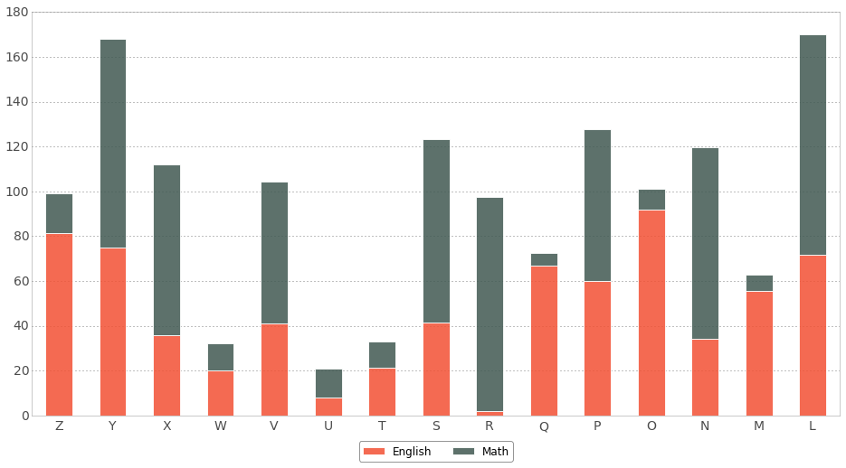
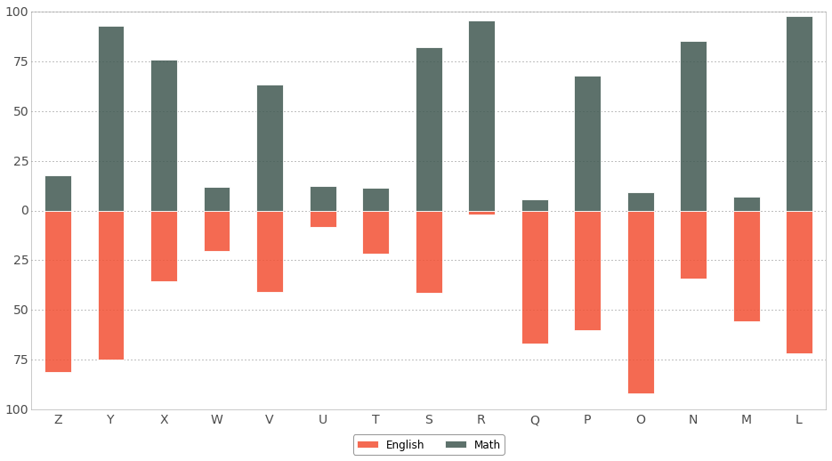

# Theory of Data Visualization

Visualization is meant to convey information.

> The power of a graph is its ability to enable one to take in the quantitative information, organize it, and see patterns and structure not readily revealed by other means of studying the data.

\- Cleveland and McGill, 1984

Certain techniques make that information easier to interpret and understand. In their 1984 paper titled, "[Graphical Perception: Theory, Experimentation, and Application to the Development of Graphical Methods](https://www-jstor-org.libproxy.berkeley.edu/stable/2288400?seq=1#page_scan_tab_contents)," Cleveland and McGill identify 10 elementary perceptual tasks that are used to "extract quantitative information from graphs." Their premise:

> A graphical form that involves elementary perceptual tasks that lead to more accurate judgments than other graphical forms (with the same quantitative information) will result in better organization and increase the chances of a correct perception of patterns and behavior.

Whereas graph design had, up to that point, been "largely unscientific," Cleveland and McGill took a systematic approach in analyzing human graphical perception through experimentation. Their researched helped identify the most and least accurate elementary perceptual tasks, ordered below:

1. Position along a common scale
2. Position along non-aligned scales
3. Length, direction, angle
4. Area
5. Volume, curvature
6. Shading, color saturation

In 2010, [Heer and Bostock](http://vis.stanford.edu/files/2010-MTurk-CHI.pdf) confirmed these results using Amazon's Mechanical Turk.

Let's take a look at a few examples. Because we're only interested in relative sizes, we don't include a legend with size information or reference points.


For circles of distinctly different sizes, the comparison is simple. For example, "A" is smaller than "B." However, for circles, such as "L" and "M," that are almost the same size, it's difficult to tell which is smaller. Area, according to Cleveland and McGill's research, is less accurate than, say, length, which we consider next.


Focusing on "L" and "M," it is clear to see which is larger. You might be wondering whether scale makes a difference -- that is, if the small circle sizes make it difficult to compare -- it doesn't.

Next, we consider a case where we want to plot two series. For this example, let's suppose we're working with student English and math test scores. Here, we'll want to use bars, which we arbitrarily label Z-L. The question is, which bars should we use? This is a case where the answer depends on what we're trying to communicate. If we're interested in showing total scores, we could use a stacked bar chart.



We can tell that "Y" and "L" had the highest cumulative scores. What if we want to know which students scored highest on the math exam? Because the math portions of each bar are on "non-aligned scales," as Cleveland and McGill call it, it's difficult to tell. One solution is to plot these on opposite sides of the x-axis.



Now, it's easier to see that "R" scored quite well on the math exam. The tradeoff with this layout is that it's difficult to compare cumulative scores. Comparing "Z" and "O," for example, is a challenge. Again, it depends on what the message is.

These findings are a *guide* for what works when the goal is to make accurate judgments. Sometimes, however, the goal might not be to allow for precise comparisons but, rather, to facilitate the perception of larger patterns. In those cases, we'll be required to use elements lower on the list of perceptual tasks - particularly color and shading - in order to efficiently convey a point.

## Form and Function

> A good graphic realizes two basic goals: It **presents** information, and it allows users to **explore** that information.

\- Alberto Cairo

-------------------------


# Plotting in R

There are two major sets of tools for creating the plots we'll explore in R today:

1. Base graphics, which come with all R installations. 

2. `ggplot2`, a stand-alone package.  

> We won't cover base graphics in this class session, but encourage everyone to explore graphics with in the 3 hour workshop material, [located here](https://github.com/dlab-berkeley/R-Data-Visualization)

Note that other plotting facilities do exist (notably, `lattice` and a variety of geospatial and niche visualization package), but R-base graphics and `ggplot2` are by far the most widely used. Check out [this post](https://stackoverflow.com/questions/2759556/r-what-are-the-pros-and-cons-of-using-lattice-versus-ggplot2) on comparisons between base, `ggplot2`, and `lattice` graphics to learn more.

## Package installation

First, we'll install and import the necessary packages. Let's get started!

```{r import}
# install pacman if needed. 
if (!require("pacman")) install.packages("pacman")

# loads libraries, installs if needed.
pacman::p_load( 
  here, dplyr, # data management
  ggplot2, cowplot # visualization
  )

```

## Dataset Details

For the following examples, we will using the gapminder dataset. Gapminder is a country-year dataset with information on life expectancy and GDP per-capita. Check out more on gapminder in this [Github repository](https://github.com/jennybc/gapminder).

```{r import_gap}

gap <- read.csv(here::here("data/gapminder-FiveYearData.csv"), stringsAsFactors = TRUE)
head(gap)
str(gap)
```

# The ggplot2 way

>This is the Way. 

\- The Mandolorian

-------------------------


>NOTE: `ggplot2` is the name of the package, but `ggplot` is the main function call. 
A ggplot is comprised of three fundamental building blocks:

 1. **Data:** typically as a dataframe.

 2. **"aes"thetics:** an `aes` function is used to define x and y axes, map colors to factor levels, etc.  
 3. **"geom_"s:** geometries, visual functions used to represent your data as points, bars, lines, ribbons, polygons, etc. 

One thing to remember is that `ggplot2` works in layers, similar to photoimaging software like Photoshop, Illustrator, Inkscape, GIMP, ImageJ, etc. We create a base layer, and then stack layers on top of that base layer. New layers are added to a plot using  the addition **`+`** symbol. Lastly, plots can be further customized using a host of **"theme_"** functions.
 
## Building a histogram layer by layer

We'll demonstrate the layer-based approach in `ggplot2` by building the same histogram of age as in the previous section.

### Define the base layer

First, to construct the base layer, we pass in two arguments to the `ggplot` function: the data and the global aesthetics (the ones that apply to all layers of the plot) defined within `aes()`. Once we do this, we see our coordinate system, but no data! 

Notice that the output of the `ggplot` function can be stored in a variable, which we've called `plot`. This allows us to continually add layers to `plot` in downstream code, and visualize how it looks at different points.

```{r base_layer}

plot <- ggplot(data = gap, aes(x = lifeExp))
print(plot)
```

### Add the histogram layer

We need the last building block: a `geom_` function, which in this case, is `geom_histogram`. Add `geom_histogram` to see the data!

```{r histogram_layer}

  # notice the plus sign for adding a layer
plot <- ggplot(data = gap, aes(x = lifeExp)) + 
 # let's add an outline and fill color to our plot.
  geom_histogram(color = "orange", fill = "green")

print(plot)
```

Ahh, my eyes! Always do your best to avoid [chartjunk](https://en.wikipedia.org/wiki/Chartjunk)! Keep  visualizations simple and crisp so they can efficiently communicate their point without losing your audience to confusion, and in this case, mild nausea. 

### Customize with theme layers

Themes in `ggplot2` are top-level layers which can be use to stylize and customize plots. Themes contain many components, which can be used to change every part of the plot, including the fonts, label sizes, label placements, and more. `ggplot2` comes with some built-in themes that you can easily add to a plot to give it a clean, recognizable, and consistent style. One of the most commonly used themes is a black and white theme, denoted by `theme_bw()`:

```{r hist_w_theme}

plot <- 
  ggplot(data = gap, aes(x = lifeExp)) + 
  geom_histogram(color = "black", 
                 fill = "gray80", 
                 bins = 10) + 
  # add a prebuilt theme
  theme_bw()

print(plot)
```

We can also use label and title layers to customize the axis and title labels. Note, however, the syntax differences of each layer compared to base plotting arguments from earlier.

```{r hist_w_labels}

hist <- 
  ggplot(data = gap, aes(x = lifeExp)) + 
  geom_histogram(color = "black", 
                 fill = "gray80", 
                 bins = 10) + 
  theme_bw() + 
  ggtitle("Histogram of Life Expectancy") + 
  # notice how we add layers with + and new lines.
  xlab("Years") + 
  ylab("Frequency") 

print(hist)
```

We can also assign this visualization to a variable for later use

> **Challenge 1:** Open `R-Data-Visualization-Challenges.Rmd`. Create a histogram of cholesterol, named "chol", in the heart dataset using `ggplot`. Save the plot as a variable named `A`.

```{r load_challenge_1_dataset}

# load heart dataset
heart <- read.csv(here("data/heart.csv"))

# variable names in heart dataset
heart %>% names()

```

```{r challenge_1}
# add your code here. 


```


# Barplots

We need to restructure our data a bit before we begin to explore how to create a barplot, so let's do that now by creating a new datafram where we calculate the number of countries per continent.

```{r countries_by_continent }

# create new dataframe from gap called countries_by_continent
countries_by_continent <- gap %>%
  # filter only distinct country names, keeping all data in the observation row
  dplyr::distinct(country, .keep_all = TRUE) %>%
  # group those country observations by the continent they are in
  dplyr::group_by(continent) %>%
  # count the countries via their continent attributes
  dplyr::count() %>%
  # rename colomn as n_countries.
  dplyr::rename(n_countries = n)

countries_by_continent

```

Like in the histogram example, we specify a dataframe, an aesthetic, and then tack on a `geom_col` geometry:

```{r barplot_ggplot}

bar <- ggplot(countries_by_continent, aes(x = continent, y = n_countries)) +
  geom_col() + 
  theme_bw() + 
  xlab("Continent") +
  ylab("Number of Countries") +
  ggtitle("Number of Countries per Continent")
print(bar)
```

There is also a `geom_bar` function that is more to the point. This can be used to count the number of entries per group for us, so we don't have to create a special dataframe before plotting. Notice how we  operate on the dataframe _inside_ the `ggplot` call and before the `aes` function, passing `distinct` `country` values into the rest of the code chunk. 

```{r geom_bar}

bar2 <- ggplot(gap %>% dplyr::distinct(country, .keep_all = TRUE), aes(x = continent)) +
  geom_bar() + 
  theme_bw() + 
  xlab("Continent") +
  ylab("Number of Countries") +
  ggtitle("Number of Countries per Continent")
print(bar2)

```

## Boxplots

Boxplots in `ggplot2` are similar to other plots. Since we are exploring _bivariate_ data, the aesthetic `aes` function becomes a little more involved.

Let's repeat a previous exercise. We have two columns in `gap`: the `continent` and `lifeExp` variables. We need to provide both of these to the aesthetic so that `ggplot2` knows how to structure the boxplot. We can also provide an optional `fill` variable, which we'll assign to be the continent attribute.  

Take a look at the plot: how did our inputs to the aesthetic correspond to the outputs? What did the fill variable do? How is it different from a color option? Try removing the fill to see how the plot looks without it.

```{r boxplot_gap}

box <- ggplot(data = gap, aes(x = continent, y = lifeExp, fill = continent)) + 
  geom_boxplot() + 
  theme_minimal()
print(box)
```

Notice that the fill in this case is a **redundant encoding** of continent. It doesn't tell us any new information. In general, this is considered bad practice - we want to keep our plots as simple as possible. If the continent is already captured by the $x$-axis, we shouldn't need to use color to convey it as well. However, there are exceptions to every rule, and sometimes it may be useful to redundantly encode a variable.

In the above plot, we have a legend, now that we've used the `fill` option. The legend can be removed  by adding the `legend.position` argument of a theme layer that is applied on top of the minimal theme we're working with:

```{r boxplot_gap_legend}

boxplot_legend <- ggplot(data = gap, aes(x = continent, y = lifeExp, fill = continent)) +
  geom_boxplot() + 
  theme_minimal() +
  # remove legend from plot. 
  theme(legend.position = "NULL")
print(boxplot_legend)

```

Like many `ggplot2` functions, `theme()` has an extensive list of arguments that can be used to tinker with your plot and get it to _just_ the place you need it to be. Using `?` to explore available options is always a good idea.

```{r theme_function}

# view help for theme function
?ggplot2::theme

```
## Scatter plots

You may be seeing a pattern in these ggplot code chunks by now! Scatter plots in `ggplot2` contain a similar bivariate structure, but this time we use a `geom_point` function to express the data. Let's examine two continous variables, life expectancy and GDP per capita, but also include information about the continent using a `color` argument:

```{r scatter_ggplot}

scatter <- ggplot(data = gap, aes(x = gdpPercap, y = lifeExp, color = continent)) + 
  geom_point() + 
  theme_test()
print(scatter)
```

>Notice that the `color` argument in the aesthetic allowed us to capture another dimension of the data. This is a key idea: the aesthetic captures relationships amongst the data, while the geometry specifies how they're visualized.

Now, let's take a look at a variety of ways we can further customize the scatter plot.

### Custom scale breaks

Suppose we want to adjust the points at which the axis ticks appear. We can use the `scale_` theme layers to do so, by specifying "custom breaks". Specifically, to create a custom scale that goes *from* a start point *to* some end point *by* some interval, we do:

```{r custom_scale}

scale_break <- ggplot(data = gap, aes(x = gdpPercap, y = lifeExp, color = continent)) + 
  geom_point() + 
  theme_bw() + 
  theme(legend.position = "top", 
        axis.text.x = element_text(angle = 45, hjust = 1)) + 
  scale_x_continuous(breaks = seq(from = 0, to = 120000, by = 20000), limits = c(0, 120000)) + 
  scale_y_continuous(breaks = seq(from = 20, to = 90, by = 10), limits = c(20, 90))
print(scale_break)
```

### Point sizes, shapes, transparencies

Let's push how far we can take the aesthetic and theme customizations we can do:

```{r point_sizes_theme}

fancy_plot <- 
  ggplot(data = gap,
         aes(x = gdpPercap,
             y = lifeExp, 
             color = continent, 
             shape = continent)) + 
  # We add the alpha argument to control the opacity of each data point that is displayed.
  # Alpha accepts values between 0 and 1, with lower values indicating more transparency.
  geom_point(alpha = 0.50, size = 2) + 
  theme_bw() + # Does it still work if you add this theme after the other theme? 
  theme(legend.position = "top", 
        axis.text.x = element_text(angle = 45, hjust = 1)) + 
  scale_x_continuous(breaks = seq(from = 0, to = 120000, by = 20000), limits = c(0, 120000)) + 
  scale_y_continuous(breaks = seq(from = 0, to = 90, by = 10), limits = c(20, 90)) +
  xlab("GDP Per Capita") +
  ylab("Life Expectancy") + 
  ggtitle("Life Expectancy vs. GDP Per Capita across Years and Countries")
print(fancy_plot)
```

Notice that we are redundantly encoding continent via shape and color. In this plot, it probably doesn't serve much purpose - but we are demonstrating how you can easily use both aspects of the aesthetic to provide more information in ``ggplot``.

### Log-transforming axes

Alternatively, you can [log transform](https://stats.stackexchange.com/questions/298/in-linear-regression-when-is-it-appropriate-to-use-the-log-of-an-independent-va) an axis. This is useful in the plot we are examining, because GDP per capita varies over several orders of magnitude:

```{r log_transform}

scatter <- ggplot(data = gap, aes(x = gdpPercap, y = lifeExp, 
                       color = continent)) + 
  geom_point(alpha = 0.50, size = 2) + 
  theme_bw() +
  theme(legend.position = "top", 
        axis.text.x = element_text(angle = 45, hjust = 1)) + 
  scale_x_log10() + 
  scale_y_continuous(breaks = seq(from = 0, to = 90, by = 10), limits = c(20, 90)) +
  xlab("GDP Per Capita") +
  ylab("Life Expectancy") + 
  ggtitle("Life Expectancy vs. GDP Per Capita across Years and Countries")

print(scatter)

```

> **Challenge 2:** Open  Create a scatterplot that visualizes the relationship between patient age `age`,  and Serum cholesterol `chol` using `ggplot`. Save it in a variable named `C`.

```{r challenge_2_dataset_names}

heart %>% names()

```

```{r challenge_2}

# your code here. 

```


## Line plots

Line plots are useful for visualizing change in some variable on the y-axis plotted against time

We'll calculate the the mean `lifeExp` for each continent by year. Check out D-Lab's [Data Wrangling and Manipulation in R](https://github.com/dlab-berkeley/R-wrang) to learn more! 

```{r mean_life_exp}

gap_mean_life_exp = gap %>%
  dplyr::group_by(year, continent) %>%
  dplyr::mutate(mean_lifeExp = round(mean(lifeExp)))

head(gap_mean_life_exp)
```

Next, we'll plot the mean life expectancy using `geom_line`:

```{r lineplot}

line <- ggplot(gap_mean_life_exp, aes(x = year,
                                      y = mean_lifeExp,
                                      color = continent)) + 
  geom_line(lwd = 1) + 
  theme_bw() + 
  theme(legend.position = "top")

print(line)
```

## Subplots with a facet wrap

An alternative approach to showing the previous plot is to separate each of the individual curves into their own subplots. This can be done with a `facet_wrap`, in which we choose a variable (i.e., a facet) by which to split the plot into individual subplots:

```{r facet_wrap}

facet_line <- line + 
  facet_wrap(~continent) + 
  guides(linetype = "none") + 
  theme(axis.text.x = element_text(angle = 45, hjust = 1))

print(facet_line)
```


> **Challenge 3:** Create a line plot of the mean cholesterol for each age, separated by sex using the heart data. You will need to do some data manipulation with `dplyr` to make this plot. Save your plot to a variable named `D`.

```{r challenge_3}


```

# Creating compound figures using `cowplot`

Publication quality figures often incorporate several subplots, which together tell a narrative about the problem being studied. We saw above that `ggplot2` can create something like a subplot using facets, but it can be quite limited. A package called `cowplot` makes it easy to stitch together individual plots into a bigger figure:

```{r compound_figure}

compound <- plot_grid(line, hist, scatter,
                      nrow = 1,
                      ncol = 3,
                      scale = .7, 
                      labels = c("A)", "B)"))
print(compound)
```

# Exporting

Exporting graphs in R is straightforward. Start by clicking the "Export" button:

1. Click **Copy to clipboard...** if you want to quickly copy/paste a figure into a slideshow presentation or text document.

2. Click **Save as image...** (Raster/Bitmap formats such as .png, .jpeg, .tiff) if you want to explort to this format.

> NOTE: Not recommended because every pixel of a plot contains its own separate coding; not so great if you want to resize the image  

3. Click **Save as PDF...** (Vector format such as .pdf, .ps) to export to .pdf.  

> NOTE: Recommended! Every element of a plot is encoded with a function that gives its coding conditional on several factors, which makes it great for resizing. 

4. Or, **export with `ggsave`**  

```{r eval = FALSE}
# Assume we saved our plot is an object called example.plot
ggsave(filename = "compound.pdf",
       plot = compound, 
       width = 12,
       height = 8,
       units = "in",
       dpi = 600)
```

> **Homework Challenge:** Use `cowplot` to create a compound figure named `compound_figure` that contains subplots `A`, `B`, `C`, that you completed above, and `D` (a plot of your own creation)  

_Hint_: think of your compound plot as a dataframe. Toggle the `ncol` & `nrow` arguments to accomodate spacing of the charts best. 

```{r homework_challenge}


```

# Resources for data visualization

Here, we provide some useful resources that may deepen your data visualization skills:

* Wickham et al. 2019. [ggplot2](https://ggplot2.tidyverse.org/): The `ggplot2` documentation.

* [ggplot2 cheatsheet](https://rstudio.com/wp-content/uploads/2019/01/Cheatsheets_2019.pdf): A helpful cheatsheet to `ggplot2`.

* Wilke CO. 2019. [Introduction to cowplot](https://cran.r-project.org/web/packages/cowplot/vignettes/introduction.html): An introductory vignette (and accompanying documentation) to `cowplot`.

* Wilke CO. 2019. [Arranging plots in a grid](https://wilkelab.org/cowplot/articles/plot_grid.html): A vignette detailing subplotting in `cowplot`.

* Tufte ER. 2001. [The Visual Display of Quantitative Information](https://www.amazon.com/Visual-Display-Quantitative-Information/dp/1930824130): One of the definitive books on data visualization.

* Wilke CO. 2019. [Fundamentals of Data Visualization](https://serialmentor.com/dataviz/): Online (i.e., free) textbook covering data visualization, written by the creator of `cowplot`. 

* Wilkinson L. 1999. [The Grammar of Graphics](https://www.amazon.com/Grammar-Graphics-Statistics-Computing/dp/0387245448): A classic text on data visualization, which served as the inspiration for the structure of `ggplot2`.

* [The R Graph Gallery](https://www.r-graph-gallery.com/index.html): A handy repository of example visualizations in R.
